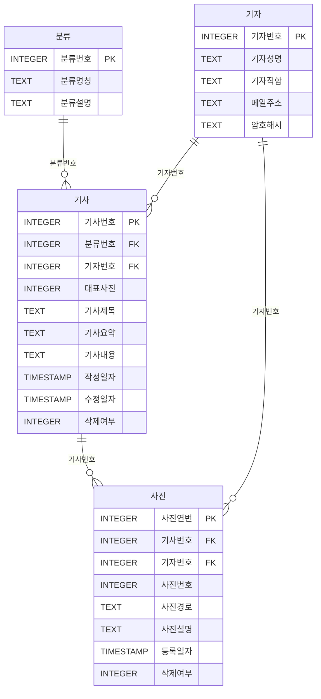

# mediafact

## MediaFact 데이터베이스 스키마

```mermaid
erDiagram
    분류 {
        INTEGER 분류번호 PK
        TEXT 분류명칭
        TEXT 분류설명
    }
    기자 {
        INTEGER 기자번호 PK
        TEXT 기자성명
        TEXT 기자직함
        TEXT 메일주소
        TEXT 암호해시
    }
    기사 {
        INTEGER 기사번호 PK
        INTEGER 분류번호 FK
        INTEGER 기자번호 FK
        INTEGER 대표사진
        TEXT 기사제목
        TEXT 기사요약
        TEXT 기사내용
        TIMESTAMP 작성일자
        TIMESTAMP 수정일자
        INTEGER 삭제여부
    }
    사진 {
        INTEGER 사진연번 PK
        INTEGER 기사번호 FK
        INTEGER 기자번호 FK
        INTEGER 사진번호
        TEXT 사진경로
        TEXT 사진설명
        TIMESTAMP 등록일자
        INTEGER 삭제여부
    }

    분류 ||--o{ 기사 : "분류번호"
    기자 ||--o{ 기사 : "기자번호"
    기사 ||--o{ 사진 : "기사번호"
    기자 ||--o{ 사진 : "기자번호"
```